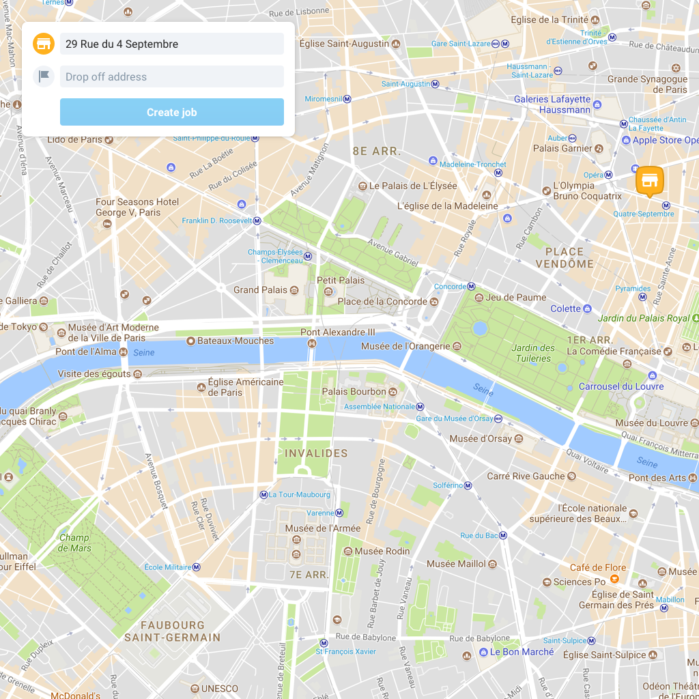
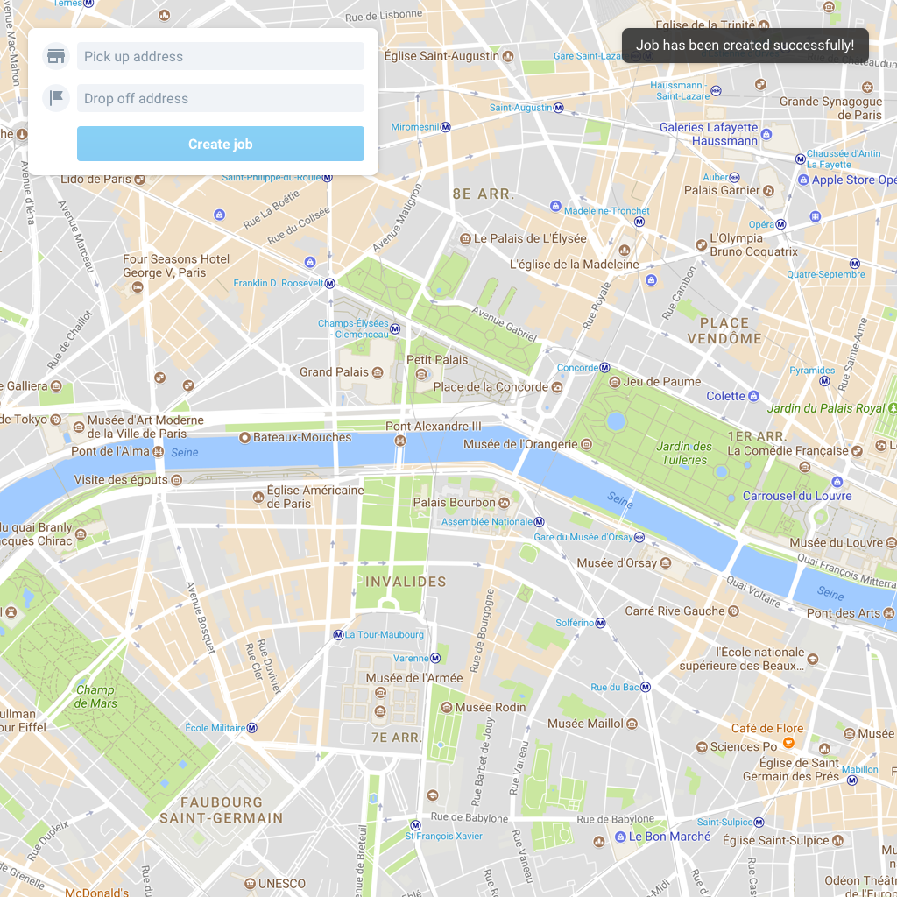

Stuart frontend challenge
=========================

Create a `React.js` app that allows users to create Stuart jobs.

## Specs

### Step 1

Implement this design in `React.js` following the [design specifications below](#design).

### Step 2

When the user leaves a field (on blur), the address should be geocoded. This can be done by sending a request to `POST /geocode` with `{ "address": "29 Rue du 4 Septembre" }`.

If the address is valid, the icon color should change (yellow for pick up and green for drop off) and a marker should be added on the map.

**Bonus points:** geocode the address once the user stops typing, besides on blur.

If the address is invalid, the icon color should be red.

Once the form is filled with two valid addresses, the button should be enabled.

### Step 3

When the user clicks on the button, a request to `POST /jobs` with `{ "pickup": "29 Rue du 4 Septembre", "dropoff": "15 Rue de Bourgogne" }` should be sent.

**Bonus points:** While the request is pending, the button should be disabled and its wording should change to "Creating...".

### Step 4

Once the `POST /jobs` request is done, the form should be reseted and a toaster saying "Job has been created successfully!" should appear. If the user clicks, the toaster should disappear.

**Bonus points:** Make the toaster disappear automatically after 5 seconds.

### Step 5

How would you improve the app? Write in a few lines how do you think the app can be improved and what would you do different if you had more time.

### Design

## Notes

- The API is included. Run `yarn install` and `yarn start` to run the API. It only works with two addresses `"29 Rue du 4 Septembre"` and `"15 Rue de Bourgogne"`. If the API does not know the address it will return an error.
- Assets can be found in the `assets/` folder.
- Use [Google Maps Javascript API](https://developers.google.com/maps/documentation/javascript/get-api-key).
- App must work in the latest Chrome version.
- Source code must be hosted on git (You can create a free repository in Github, [Gitlab](https://gitlab.com) or [Bitbucket](https://bitbucket.org)).
- Once you are done, send a email to j.oliger@stuart.com with: a link to the git repository, the time spent on the project and a list of any issues you encountered while doing the challenge.
- Please contact us if you have any question.
